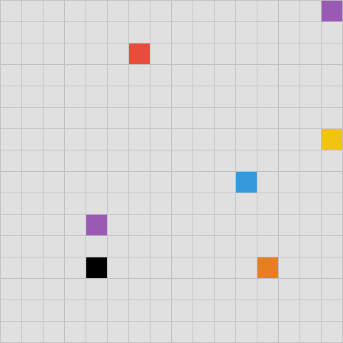

## r/place

Pick a color. Click a cell. One pixel at a time.

[⬛](colors/black.md) [⬜](colors/white.md) [🟥](colors/red.md) [🟦](colors/blue.md) [🟩](colors/green.md) [🟨](colors/yellow.md) [🟪](colors/purple.md) [🟧](colors/orange.md)

