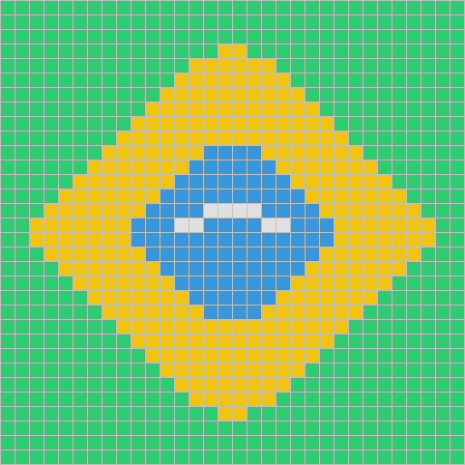

## r/place

Pick a color to place a pixel, or [draw something](https://github.com/aburkard/aburkard/issues/new?title=&body=%3C%21--+Type+your+request+as+the+issue+title%2C+then+submit.%0A%0AExamples%3A%0A-+Add+a+blue+ghost+next+to+the+red+one%0A-+Draw+a+small+green+tree+in+the+top+right%0A-+Write+%22hello%22+in+orange%0A-+Clear+the+bottom+row+--%3E) with AI.

[⬛](colors/black.md) [⬜](colors/white.md) [🟥](colors/red.md) [🟦](colors/blue.md) [🟩](colors/green.md) [🟨](colors/yellow.md) [🟪](colors/purple.md) [🟧](colors/orange.md)

